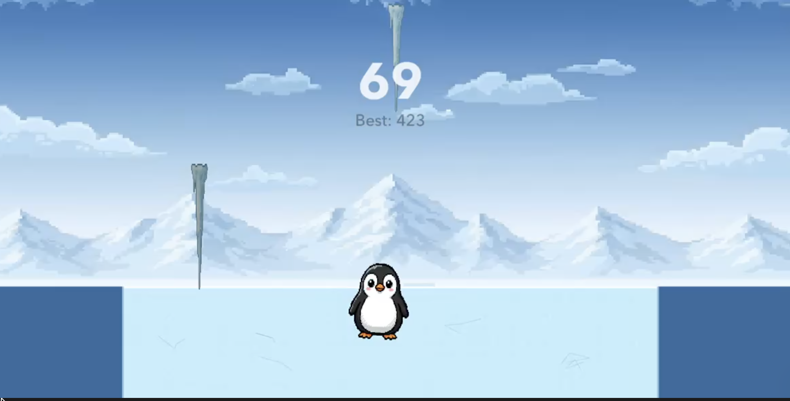

# Penguin Slide

<!-- screenshot of the game, rotated 90 degrees -->

Tilt-controlled iOS game where a penguin slides on ice to dodge cracking, falling icicles. iOS 17+. SpriteKit + SwiftUI. Bitmap pixel-art sprites for the penguin, icicles, ice tile, and sky; transient effects (snow puffs, shatter shards, HUD heart) are drawn procedurally at runtime.

## Setup

1. **Xcode → New Project → App** (iOS). Interface: **SwiftUI**. Language: **Swift**. Name it `PenguinSlide`.
2. Delete the auto-generated `ContentView.swift` and `PenguinSlideApp.swift`.
3. Drag the entire `PenguinSlide/` source folder into the project (check "Copy items if needed"). This brings in all Swift files (`PenguinSlideApp`, `ContentView`, `GameScene`, `Penguin`, `PenguinAnimations`, `PenguinTuning`, `Tuning`, `IcicleSystem`, `HUDController`, `SpriteCatalog`, `SettingsView`, `PlayerProfile`) along with `Assets.xcassets` and the `Sounds/` directory.
4. **Motion permission**: required, or CoreMotion crashes on first use.
   - In Xcode 15+, the default project uses a generated Info.plist (no file). To add the motion key: select your target → **Info** tab → under **Custom iOS Target Properties** add a new row:
     - Key: `Privacy - Motion Usage Description`
     - Value: `Penguin Slide uses motion to slide the penguin when you tilt your phone.`
   - **Or** drop the included `Info.plist` into the project and set **Build Settings → Info.plist File** to `PenguinSlide/Info.plist`, and **Generate Info.plist File** = **No**.
5. **Orientation**: target → **General** → **Deployment Info** → uncheck Landscape Left/Right (portrait only).
6. Run on a **physical device**. The simulator has no real gyro. ⌘R.

## Testing

See [TESTING.md](TESTING.md) for the automated test scripts (`test-smoke.sh`, `test-perf.sh`, `test-xcui.sh`) and the XCUITest target.

## How it plays

- Tilt phone left/right → penguin slides.
- Icicles appear at the top, shake and crack for ~0.75 s (telegraph), then fall.
- Penguin starts with 3 HP. Each hit costs a heart, then grants ~1 s of invulnerability (visible as a flicker). Three hits end the round. Tap to restart.
- Spawn rate and fall speed ease up over 90 s, so it starts very easy and gradually ramps.

## Where to tweak difficulty

Open `Tuning.swift`. Constants are grouped into nested namespaces by subsystem.

### `Tuning.Penguin`: input & feel

| Knob | Effect |
|---|---|
| `maxSpeed` | How responsive the penguin is to tilt. Points/sec at full tilt. |
| `tiltCurve` | Tilt → speed curve exponent. 1 = linear, >1 rewards aggressive tilts, <1 makes small tilts twitchier. |
| `collisionRadiusFraction` | Hitbox radius as a fraction of sprite width. Sized so the hitbox reaches above the ice line into the icicle's fall path. Lower it for a more forgiving hitbox, at the cost of icicles passing through the upper sprite without contact. |
| `tiltResponseRate` | Velocity-toward-target rate while tilting. Higher = snappier accel. |
| `iceDecayRate` | Velocity decay rate when no tilt is held. Lower = longer glide after release. |
| `leanMaxAngle` | Max body lean angle in radians (~0.30 ≈ 17°). |
| `leanStiffness` | Spring strength (ω₀²). Higher = lean snaps to target faster. |
| `leanDampingRatio` | 0 = no damping (oscillates forever), 1 = critically damped (no overshoot), >1 = overdamped. ~0.55 gives a satisfying brief overshoot when reversing direction. |
| `massKg` | Mass for restitution math when an icicle contacts the penguin. The manual gravity loop ignores mass. |
| `maxHealth` | HP at round start. Default 3. |
| `iFrameDuration` | Seconds of invulnerability after a hit. Contacts inside this window are absorbed (no damage) but still visibly recoil the icicle. |
| `iFrameFlashHz` | Sprite-alpha flicker frequency during i-frames. |
| `knockbackImpulseScale` | Sideways shove on hit, as a fraction of `maxSpeed`. 0.5 ≈ ±360 pt/s impulse that `iceDecayRate` settles within ~1 s. |

### `Tuning.Icicle`: telegraph & per-icicle gravity

| Knob | Effect |
|---|---|
| `warningDuration` | How long icicles telegraph before falling. |
| `spawnIntervalStart / End` | Cadence at game start vs. peak difficulty. |
| `sceneGravity` | World gravity magnitude (pt/s²) applied to icicles + shards. |
| `gravityScaleStart / End` | Mean per-icicle gravity scale at game start vs. peak. Lower = slower fall. |
| `gravityScaleVariance` | Per-spawn ± fraction around the mean so adjacent icicles fall at different rates. |
| `initialDownVelocity` | Small downward kick at detach so even light icicles start moving. |
| `massKg` | Mass for restitution math against the penguin. Manual gravity ignores it. |
| `restitution` | 0–1 bounciness of an icicle as it recoils off the penguin. The recoil itself is applied manually. |

### `Tuning.Chase`: aim algorithm

| Knob | Effect |
|---|---|
| `leadFactor` | How much icicle aim leads the penguin's velocity. 0 = no lead; 1 = full ballistic lead (over-leads in practice). |
| `jitterStart / End` | Random spread around the aim point, as a fraction of ice-strip width. Start = early game (loose); End = late game (tight). |
| `randomChance` | Fraction of spawns that ignore the penguin and pick a random column. Keeps the field unpredictable. |

### `Tuning.Feel`: impact polish

| Knob | Effect |
|---|---|
| `shardCountMin / Max` | Shards per shatter, interpolated by impact severity: distant landings emit `Min`, direct hits emit `Max`. |
| `shardLaunchSpeed` | Base pop velocity for shards (scaled by severity). |
| `shardSeverityBoost` | Extra launch-speed multiplier at a direct hit (e.g. 0.30 = +30% pop on dead-on landings). |
| `shardLifetime` | Fade-out duration before shards are removed. |
| `shakePeakAmplitude` | Max camera shake offset (pt) when an icicle lands directly on the penguin. |
| `shakeRadius` | X-distance at which a landing produces zero shake. Linear falloff. |
| `crackBurstShards` | Shard count for a confirmed-damage penguin hit (separate from the landing-on-ice burst). |
| `crackBurstSpeedScale` | Pop-speed multiplier for the penguin-contact crack burst. |

### `Tuning.Run`: round-level pacing

| Knob | Effect |
|---|---|
| `rampDuration` | Seconds from start to peak difficulty. |
| `gracePeriod` | Quiet seconds at the start of every round. |
| `playWidthFraction` | Width of the ice strip the penguin is confined to (0–1). Lower = tighter dodge corridor. |

## Notes on the code

- Uses `CMMotionManager.startDeviceMotionUpdates()` (single instance, no callback queue) and reads `deviceMotion.gravity.x` synchronously from the SpriteKit `update(_:)` loop. This is the recommended pattern: fused sensor data, no main-queue callback storm, frame-locked.
- The penguin physics body is dynamic but `collisionBitMask = 0`; we drive position manually each frame, and knockback is applied directly to the penguin's `vx`. SpriteKit isn't allowed to displace the penguin, so the manual position writes are the single source of truth.
- Icicles have no physics body during the warning phase, then gain a dynamic body with `usesPreciseCollisionDetection = true` the moment they detach. The latter prevents tunneling at peak fall speeds (≈15 pt/frame at 60 fps).
- Hit response is two-sided: the penguin loses HP via `tryTakeHit` (with i-frames gating consecutive damage), and IcicleSystem.onIcicleHitPenguin manually recoils the icicle and emits the crack burst. Both sides agree on direction so the visuals feel coherent.
- Scene is held in `@State` in `ContentView` so SwiftUI redraws don't recreate it (a known iOS 15-era footgun that's still the correct pattern to avoid).

## App Store Description

A small penguin against a big mountain of icicles. Tilt to dodge, slide to survive, beat your own best. Plays in landscape, one-handed.

You are a small, round penguin on a long sheet of ice. Above you, a mountain. From the mountain, icicles. Your job is to not get hit by them.
Tilt your phone left or right and the penguin slides with you. The longer you survive, the faster the ice falls. That's the whole game. No tutorials, no menus to click through, no ads waiting to interrupt you.

WHAT'S IN IT:
One-thumb tilt controls using your phone's motion sensor
Falling icicles that get faster the longer you live
A best-score that only competes with yourself
Landscape play, sized for short breaks
Pixel-art penguin who looks personally betrayed every time he gets hit

WHAT'S NOT IN IT:
Accounts or sign-ups
Internet connection
Ads
Tracking, analytics, or data collection of any kind
In-app purchases
Daily login streaks designed to guilt you

The game runs entirely on your device. Your high score lives on your phone and nowhere else. If you delete the app, you delete the data. There is no copy anywhere.
Built for the kind of moments where you want to play something for two minutes without committing to anything. Waiting for the kettle. Standing in line. The thirty seconds before a meeting starts.
Best played with sound on, but it'll mix with your music if you'd rather have your own soundtrack to penguin survival.
Tilt left. Tilt right. Don't get hit. Beat your last run.