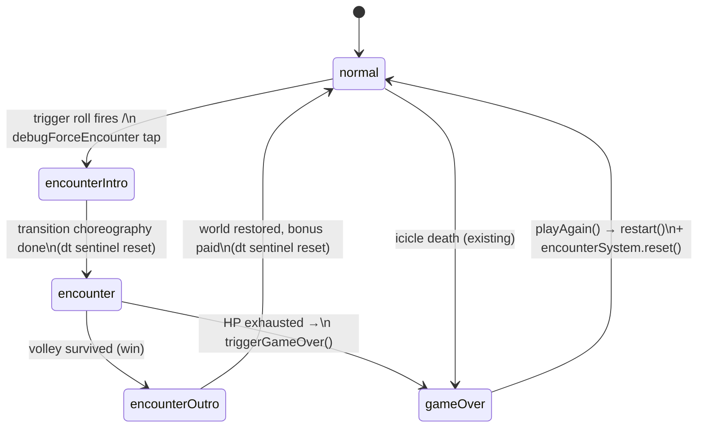

# feat: Snow Monster boss encounter mode

## Summary

At random points during a normal run, the game interrupts the 2D side-view ice field with a pseudo-3D "Snow Monster" boss encounter: the camera appears to swing behind the penguin (branded **Papi Penguin** for this mode), who slides forward into a mountain vista while a snowman-like snow monster ahead hurls snowballs toward the camera. The player dodges laterally — goalkeeper-style — using the exact same tilt input pipeline, tuning values, and feel as the normal game. Surviving the volley returns the player to the normal run with a score reward; running out of hearts ends the run through the standard game-over flow.

SpriteKit is a 2D engine, so the 3D look is faux-3D: a `DepthProjector` maps a virtual depth coordinate to screen position + scale (projectiles grow as they approach the camera), collision is a manual depth-window check, and the "sliding forward" illusion is scrolling perspective ground art. No SceneKit, no scene swap — the encounter is a phase inside the existing `GameScene`.

Art arrives from a parallel SpriteCook agent and SFX from a parallel ElevenLabs agent; this plan builds everything behind procedural placeholders and defines exact swap-in integration points so asset delivery is a content change, not a code change.

---

## Problem Frame

The current game is a single-loop survival mode (dodge falling icicles). The request adds a second gameplay vocabulary — a depth-axis dodge sequence — that must:

1. Feel like the same game: identical tilt dynamics, sensitivity (`Tuning.Penguin` / `PenguinTuning` from UserDefaults), dead zone, and simulator fallbacks (`MotionInjector`, `GCKeyboard`).
2. Respect architecture invariants from `CLAUDE.md`: manual physics (zero scene gravity, contact-detection-only bodies, single source of truth for player position), the update-loop ordering contract, `dt == 0` sentinel symmetry across all resume/transition paths, `#if DEBUG` gating for test hooks, SKLabelNode-only accessibility for XCUITest.
3. Flow into and out of the normal run without state corruption: shared HP, shared score, shared best-score persistence, shared pause/settings/app-lifecycle handling.
4. Land before assets exist (parallel agents are generating art/SFX) without blocking or churning.

## Requirements

- R1: Random encounter trigger during a normal run (eligibility window + spacing + probability), never during the start prompt, game-over, or i-frames.
- R2: Pseudo-3D behind-the-penguin presentation: perspective mountain backdrop, forward-slide illusion, snow monster ahead at far depth, snowballs flying toward the camera with perspective scaling.
- R3: Papi Penguin branding embedded in the encounter (intro banner, encounter HUD copy, rear-view sprite set) — the 3D-perspective world is fully committed, not a reskinned side view.
- R4: Dodge input reuses the existing tilt pipeline verbatim — `GameScene.currentTilt()` (CoreMotion fused gravity → `screenGravity` rotation → dead zone → MotionInjector/keyboard fallbacks) and `Tuning.Penguin` motion knobs. No duplicated input or motion-feel code.
- R5: Faux-3D physics: projectile depth integration, scale-over-depth projection, and depth-based collision (manual; no SpriteKit contact pass for snowballs).
- R6: New UI: intro telegraph/transition, encounter HUD (volley progress + hearts continuity), win/lose outcome banners flowing back into the run.
- R7: Hits cost shared hearts (same HP pool + i-frames); HP exhausted in the encounter ends the run via the standard `triggerGameOver()` flow. Survival pays a score bonus through the existing bonus-points pipeline.
- R8: Asset integration points defined for SpriteCook sprites (`SpriteCatalog` enum cases + `PenguinAnimations`-style slicing + `spritecook-assets.json` manifest entries) and ElevenLabs SFX (`SKAudioNode` / `SKAction.playSoundFileNamed`, `.caf`) — wiring beads execute when the parallel agents deliver.
- R9: `debugForceEncounter` SKLabelNode hook (`#if DEBUG`) analogous to `debugForceGameOver`, plus a debug state label, so XCUITests never depend on random trigger timing.
- R10: Test coverage: unit tests for projection/collision/trigger math (new unit-test target — none exists today) and XCUITests for the encounter flow, with detailed logging.

## Assumptions

Headless planning run — these inferred bets were made without user confirmation:

- A1: **Win condition** is surviving a fixed volley of N snowballs (N and cadence scale with run progress at trigger time). The monster does not have an HP bar; there is no counter-attack mechanic. "Goalkeeper-style timed dodges" reads as pure-defense.
- A2: **Losing state** shares the normal HP pool. A snowball hit = 1 heart via the same i-frame rules. 0 hearts inside the encounter = standard game over (no "encounter retry").
- A3: **Papi Penguin branding scope** is the encounter mode only (intro banner, HUD copy, outcome banners, rear-view sprite set). The normal-mode title screen copy ("PENGUIN SLIDE") is untouched. Accessibility-label copy used by existing tests ("Tap to start") is not modified.
- A4: **Trigger shape**: eligible after ~20 s of run time, minimum ~45 s between encounters, then a per-second probability roll; at most ~2 encounters surface per typical run. All knobs in `Tuning.Encounter`.
- A5: **Faux-3D technique** is pure-SpriteKit scale-over-depth (decision detail in KTD1) — chosen unilaterally over SceneKit overlay and SKTransformNode-centric approaches.
- A6: **Survival timer pauses** during the encounter (`elapsed` keeps advancing for animation but the difficulty ramp and survival drip pause; the win bonus replaces drip income). This keeps the icicle difficulty ramp from silently advancing while no icicles fall.

---

## Key Technical Decisions

### KTD1 — Faux-3D: pure SpriteKit scale-over-depth, not SceneKit

A `DepthProjector` value type maps virtual world coordinates `(lateral x, depth z)` to screen `(position, scale)` using a single-vanishing-point perspective: `screenScale = focal / (focal + z)`, screen y rises toward the horizon line as z grows, lateral x converges toward the vanishing point. Snowballs integrate `z` from monster-depth toward 0 (camera plane) and the projector handles all growth/placement; the same projector positions the monster, lane markings, and ground scroll bands so every element agrees on the geometry.

Rejected alternatives:
- **SceneKit overlay** (`SCNScene` over/under `SpriteView`): real 3D, but it forks the rendering pipeline — separate pause semantics (breaking `view.isPaused` + `physicsWorld.speed = 0` freeze logic), separate asset pipeline (SpriteCook delivers 2D spritesheets), no SKLabelNode accessibility for tests, and double work in every app-lifecycle/settings-resume path. Cost far exceeds the visual payoff for a stylized cartoon sequence.
- **`SKTransformNode` (xRotation/yRotation)**: only perspective-tilts flat sprite planes; it cannot give projectiles depth trajectories or depth-sorted scaling. May optionally be used as polish on the backdrop layers, but it is not the core mechanism and the plan does not depend on it.

### KTD2 — Encounter is a phase inside GameScene, not a second SKScene

`GameScene` gains a `GamePhase` state machine (`normal`, `encounterIntro`, `encounter`, `encounterOutro`) and a fourth subsystem, `SnowMonsterEncounterSystem`, mirroring `IcicleSystem`'s shape (owns spawn cadence, per-frame integration, FX, audio; communicates results via callbacks). All encounter nodes live under one `encounterRoot` container node so entering/exiting is a single show/hide plus per-system reset.

Why not `SKView.presentScene` to a dedicated scene: it would tear down/duplicate `CMMotionManager`, the app-lifecycle observers, the audio session wiring, the camera, and `ContentView`'s single-`GameScene`-in-`@State` contract. The phase approach reuses every cross-cutting service for free and keeps `dt`/pause semantics in one place.

### KTD3 — Encounter collision is fully manual (no physics bodies on snowballs)

A snowball at z = 800 and Papi at z = 0 can overlap in *screen* space; SpriteKit contact detection is 2D and would false-positive. So snowballs carry **no** `SKPhysicsBody`. The encounter system checks, per frame: `|ball.z - papiZ| < depthWindow && |ball.worldX - papi.worldX| < lateralHitRadius` → hit; a ball crossing the camera plane (z ≤ 0) without a hit → dodge. This extends the codebase's "physics is manual, bodies exist only for contact detection" doctrine: where 2D contact detection can't express the test, do it by hand in the update loop. `Category.snowball` is *not* added to `Tuning.swift` — there is no bitmask to declare. The penguin's existing physics body stays inert during the encounter (no icicles are falling; `IcicleSystem.update` is not called).

### KTD4 — Tilt reuse via parameter injection; motion feel via a shared integrator

`GameScene` keeps sole ownership of input: `update(_:)` calls `currentTilt()` once per frame and passes the value to whichever subsystem is active — exactly how `penguin.update(dt:tilt:)` works today. `SnowMonsterEncounterSystem.update(dt:tilt:)` gets the identical value, so MotionInjector, keyboard fallback, orientation rotation, and dead zone are inherited with zero duplication.

The velocity *feel* (curved tilt → target velocity → asymmetric exponential approach → bounds clamp) currently lives inline in `Penguin.update`. Extract it into a small shared value type (working name `TiltSlideMotion`) consuming `Tuning.Penguin` knobs (`maxSpeed`, `tiltCurve`, `tiltResponseRate`, `iceDecayRate`), used by both `Penguin` and the encounter avatar. Same UserDefaults-backed `PenguinTuning` instance ⇒ the settings "tilt intensity" slider affects both modes identically, by construction.

### KTD5 — Continuity contracts (HP, score, dt, pause)

- **HP**: the encounter avatar proxies the existing `Penguin` instance's HP/i-frame state rather than owning a copy. Snowball hits route through `penguin.tryTakeHit(from:)` (knockback's `vx` push maps to the lateral axis naturally). `onHealthChanged` keeps hearts in sync in both HUDs. `!penguin.isAlive()` inside the encounter → `triggerGameOver()` unchanged.
- **Score**: survival drip pauses during the encounter (A6). Each dodge pays a small bonus and a clean sweep pays a volley-completion bonus, both through the existing `bonusPoints` accumulator so `score = Int(elapsed * survivalRate) + bonusPoints` needs only a "frozen elapsed" treatment (track `encounterTimeDebt` subtracted from ramp/drip math, or snapshot/restore — implementer's choice; the invariant is: post-encounter difficulty ramp and drip resume where they left off).
- **dt sentinel**: every phase transition (`normal→intro`, `intro→encounter`, `encounter→outro`, `outro→normal`) sets `lastUpdateTime = 0`, symmetric with start/restart/settings-resume/app-foreground. Settings sheet and app-background during an encounter must behave identically to normal mode (the existing handlers already reset the sentinel; the phase machine must not bypass them).
- **Update-loop ordering**: all encounter integration stays behind the `isStarted && !isGameOver` guard. Snowball collision is evaluated *inside* `SnowMonsterEncounterSystem.update` (manual, not `didBegin`), so the death frame is even simpler than the icicle path — but the freeze rules are identical: `triggerGameOver()`'s `physicsWorld.speed = 0` plus a new `encounterSystem.pauseActions()` (snowball spin/FX SKActions), mirroring `pauseShardActions()`.
- **restart()**: `playAgain()` after an encounter death must also `encounterSystem.reset()` and restore phase to `.normal`, world visibility to the side view.

### KTD6 — Placeholder-first asset strategy

All encounter code binds to `SpriteCatalog.Sprite` cases and `EncounterAnimations` frame arrays from day one. Until SpriteCook delivers, the imagesets contain committed procedural placeholders (flat-color shapes rendered once into PNGs, or `UIGraphicsImageRenderer` textures behind the catalog). Swapping in real art = replacing imageset PNGs + correcting frame counts in one file + updating `spritecook-assets.json`. Same pattern for audio: missing `.caf` files are guarded so a placeholder-silent build never crashes (`SKAudioNode(fileNamed:)` with a missing file is a crash risk — the wiring unit gates node creation on bundle presence).

---

## High-Level Technical Design

### Phase state machine



### Faux-3D projection (directional guidance, not implementation spec)

```text
DepthProjector(horizonY, vanishingX, focal, groundY(z) curve)

  z axis: 0 = camera/Papi plane … zMonster = monster's depth (e.g. ~900 virtual pt)

  project(worldX, z) -> (screenPoint, scale)
      t      = focal / (focal + z)            // 1.0 at camera, →0 toward horizon
      screenX = vanishingX + (worldX - vanishingX) * t
      screenY = horizonY  - (horizonY - papiPlaneY) * t
      scale   = t

  Snowball flight: per-frame z -= zSpeed * dt (zSpeed ramps per volley);
  optional lateral drift worldX += driftVx * dt (aimed at Papi's worldX at throw
  time, goalkeeper-style — committed trajectory, dodge by moving off the line).

  Hit test (manual, per frame, inside encounter update):
      hit   ⇔ z < depthWindow && |ball.worldX - papi.worldX| < lateralHitRadius
      dodge ⇔ z ≤ 0 with no hit  → close-call bonus, ball culled
```

zPosition ordering inside `encounterRoot`: backdrop (mountains) < monster < far snowballs < near snowballs < Papi < HUD. Snowballs re-sort zPosition by depth each frame (`zPosition = base - z * epsilon`) so nearer balls draw over farther ones.

### Encounter sequence

```mermaid
sequenceDiagram
    participant GS as GameScene
    participant TR as EncounterTrigger
    participant ES as SnowMonsterEncounterSystem
    participant P as Penguin (shared HP)
    participant HUD as HUDController
    GS->>TR: update(dt, elapsed) during normal phase
    TR-->>GS: shouldTrigger = true
    GS->>GS: phase = .encounterIntro (dt sentinel reset)
    GS->>HUD: hide normal prompts; show "SNOW MONSTER!" banner
    GS->>ES: begin(volleyPlan) — world fade/camera push choreography
    GS->>GS: phase = .encounter (dt sentinel reset)
    loop volley (N throws)
        ES->>ES: monster telegraph + throw anim, spawn snowball (z = zMonster)
        ES->>ES: integrate z toward camera, project, scale, shadow
        alt depth-window + lateral overlap
            ES->>P: tryTakeHit(from: lateralX)
            P-->>HUD: onHealthChanged → hearts
            alt !penguin.isAlive()
                ES->>GS: onEncounterDeath → triggerGameOver()
            end
        else ball crosses camera plane
            ES->>GS: onDodge(severity) → bonusPoints + HUD float
        end
    end
    ES->>GS: onVolleyComplete → phase = .encounterOutro
    GS->>HUD: "DODGED!" outcome banner, volley bonus float
    GS->>GS: restore side-view world, phase = .normal (dt sentinel reset)
```

### Module map

```text
PenguinSlide/
  GameScene.swift                  MODIFY  phase machine, routing, debug hooks, trigger wiring
  Penguin.swift                    MODIFY  motion integrator extracted to TiltSlideMotion
  TiltSlideMotion.swift            NEW     shared tilt→velocity feel (Tuning.Penguin-driven)
  Tuning.swift                     MODIFY  add `enum Encounter` knob group
  Encounter/
    SnowMonsterEncounterSystem.swift NEW   orchestrates volley, owns actors below
    DepthProjector.swift             NEW   pure math, unit-tested
    EncounterTrigger.swift           NEW   pure scheduling math, unit-tested
    EncounterWorld.swift             NEW   backdrop/ground/forward-scroll builder (under encounterRoot)
    PapiAvatar.swift                 NEW   rear-view player actor (proxies Penguin HP)
    SnowMonster.swift                NEW   boss actor (telegraph/throw/roar states)
    Snowball.swift                   NEW   projectile model (z, worldX, node, shadow)
    EncounterHUD.swift               NEW   banner/volley progress/outcome (SKLabelNode-based)
  EncounterAnimations.swift        NEW     spritesheet slicing (PenguinAnimations pattern)
  SpriteCatalog.swift              MODIFY  new Sprite cases
  HUDController.swift              MODIFY  hide/show normal HUD pieces during encounter
PenguinSlideTests/                 NEW     unit-test target (xcodegen)
  DepthProjectorTests.swift        NEW
  EncounterTriggerTests.swift      NEW
  SnowballCollisionTests.swift     NEW
  TiltSlideMotionTests.swift       NEW
PenguinSlideUITests/
  EncounterUITests.swift           NEW
project.yml                        MODIFY  PenguinSlideTests target
Sounds/ + PenguinSlide/Sounds/     ADD     5 encounter .caf files (ElevenLabs, converted)
spritecook-assets.json             MODIFY  encounter asset manifest entries
```

---

## Implementation Units

### U1. GamePhase state machine and update-loop routing

**Goal:** `GameScene` can be in `normal` / `encounterIntro` / `encounter` / `encounterOutro` phases, routing per-frame work accordingly, with `dt == 0` sentinel resets on every transition.

**Requirements:** R1, R4, R7 (continuity); CLAUDE.md update-ordering + sentinel invariants.

**Dependencies:** none (first unit).

**Files:** `PenguinSlide/GameScene.swift`.

**Approach:** Add a `GamePhase` enum + `phase` var. `update(_:)` keeps the existing dt computation and `isStarted && !isGameOver` guard at the top; inside the guard, switch on phase: `.normal` runs today's body (combo decay, `penguin.update`, `icicles.update`, score drip); `.encounter` runs `encounterSystem.update(dt:tilt:currentTilt())` only; intro/outro tick their transition timelines. A single `transition(to:)` helper owns `lastUpdateTime = 0` so no path can forget the sentinel. `IcicleSystem` is simply not ticked during the encounter (already-falling icicles are cleared by the intro — see U10). Survival-drip/ramp pause per KTD5 (encounter time debt). `restart()` resets phase to `.normal` and calls `encounterSystem.reset()`.

**Patterns to follow:** existing guard + ordering comment block in `update(_:)`; `restart()`'s sentinel comment; subsystem callback wiring in `didMove(to:)` (`onCloseCall`, `onHealthChanged`).

**Test scenarios:**
- Phase transitions reset the dt sentinel: after `transition(to:)`, next frame computes `dt == 0` (unit-assertable once U4's test target exists by exposing a testable seam, or asserted via the U16 debug state label).
- `.encounter` phase does not advance icicle spawn timers or survival drip: force encounter, wait, return; score gained equals dodge bonuses only.
- Settings open/close during `.encounter` pauses and resumes without a dt spike (no avatar teleport) — same behavior as normal mode.
- Restart after death-in-encounter restores `.normal` phase, side-view world, fresh HP.

**Verification:** normal mode behaves byte-for-byte identically when no encounter triggers; phase switches are clean with no one-frame physics leaks.

---

### U2. Extract shared TiltSlideMotion integrator

**Goal:** One implementation of the tilt→velocity feel (curve, target velocity, asymmetric exponential approach, bounds clamp + vx zeroing) consumed by both `Penguin` and the encounter avatar.

**Requirements:** R4 (DRY tilt dynamics).

**Dependencies:** none (can land before/parallel to U1).

**Files:** `PenguinSlide/TiltSlideMotion.swift` (new), `PenguinSlide/Penguin.swift` (modify), `PenguinSlideTests/TiltSlideMotionTests.swift` (new, lands with U4's target).

**Approach:** A small struct holding `vx` and bounds, with `update(dt:tilt:)` reading `Tuning.Penguin` knobs live (so runtime settings changes keep applying — match current behavior where knobs are read each frame). `Penguin.update` delegates to it; knockback writes (`vx +=`) go through a mutator so `tryTakeHit` keeps working. Behavior-preserving refactor — no feel constants change.

**Execution note:** characterization-first — capture current `Penguin.update` velocity traces for a few (tilt, dt) sequences as test fixtures before extracting, so the refactor provably preserves feel.

**Test scenarios:**
- Same (tilt, dt) sequence yields identical vx series pre/post refactor (characterization fixtures).
- tilt = 0 decays vx by `iceDecayRate`; tilt = ±1 approaches `±maxSpeed` via `tiltResponseRate`; `tiltCurve` exponent honored for partial tilts (e.g. tilt 0.5 with curve 1.5 → target = 0.5^1.5 × maxSpeed).
- Bounds clamp zeroes vx at the wall (no accumulated push-through).
- Mutating `Tuning.Penguin.applyTiltIntensity` mid-sequence changes the response immediately (live knob read).

**Verification:** normal-mode gameplay feel is unchanged (device sanity check); unit tests pass.

---

### U3. Tuning.Encounter knob group and EncounterTrigger scheduler

**Goal:** All encounter difficulty/geometry knobs in one place; a pure, unit-testable trigger scheduler that decides when a random encounter fires.

**Requirements:** R1; CLAUDE.md "Tuning.swift is the difficulty hub."

**Dependencies:** none.

**Files:** `PenguinSlide/Tuning.swift` (modify), `PenguinSlide/Encounter/EncounterTrigger.swift` (new), `PenguinSlideTests/EncounterTriggerTests.swift` (new).

**Approach:** `enum Encounter` in `Tuning` grouping: trigger knobs (`minRunTime ≈ 20 s`, `minSpacing ≈ 45 s`, `perSecondChance`, `maxPerRun ≈ 2`), volley knobs (`volleyCountStart/End`, `throwIntervalStart/End`, `zSpeedStart/End` — lerped by the *run's* difficulty progress at trigger time, mirroring `IcicleSystem.progress`), geometry knobs (`zMonster`, `focal`, `horizonYFraction`, `depthWindow`, `lateralHitRadius`, `papiLateralRange`), feel knobs (telegraph duration, dodge-bonus base, volley-completion bonus, intro/outro durations). `EncounterTrigger` is a struct fed `(dt, elapsed, isEligiblePhase)` returning fire decisions; seeded-RNG injectable for determinism in tests. Static `let` constants (not runtime-mutable) — only `Tuning.Penguin` carries the mutable-struct treatment, and encounter knobs are not settings-exposed.

**Test scenarios:**
- No trigger before `minRunTime` regardless of rolls (seeded RNG forced to fire).
- Spacing respected: after a trigger, no fire until `minSpacing` elapses.
- `maxPerRun` cap enforced; reset() re-arms for a new round.
- Probability sanity with seeded RNG: expected fire count over a simulated 120 s run within tolerance.
- Trigger never fires when told the phase is ineligible (game over / not started / already in encounter).

**Verification:** unit tests pass; knob table reads as a coherent difficulty surface (README-style annotation comments on each knob).

---

### U4. Unit-test target and DepthProjector

**Goal:** A `PenguinSlideTests` unit-test target exists (none today — only XCUITests), and the pure projection math is implemented and tested.

**Requirements:** R5, R10.

**Dependencies:** none (foundational; U2/U3 tests land into this target).

**Files:** `project.yml` (modify — add `bundle.unit-testing` target + scheme test entry), `PenguinSlide/Encounter/DepthProjector.swift` (new), `PenguinSlideTests/DepthProjectorTests.swift` (new).

**Approach:** xcodegen target mirroring `PenguinSlideUITests`'s shape but `type: bundle.unit-testing` with `@testable import PenguinSlide` host-app configuration; remember `REGEN=1` / `xcodegen generate` workflow and target-mode build scripts (a test script tweak may be needed — keep `test-xcui.sh` untouched, add the unit target to the scheme's test action). `DepthProjector` per the HTD sketch: pure functions, no SpriteKit node deps (takes/returns CGPoint/CGFloat), constructed from `Tuning.Encounter` geometry knobs + scene size.

**Test scenarios:**
- z = 0 projects to scale 1.0 at the Papi plane y; z = zMonster projects to the expected small scale (`focal/(focal+zMonster)`).
- Monotonicity: scale and screenY are strictly monotonic in z (no fold-overs); screenX converges toward vanishingX as z grows.
- Round-trip lateral consistency: two worldX values at equal z keep their order and proportional screen separation.
- Degenerate inputs: z < 0 clamps (ball passing the camera plane never inverts), zero/negative focal asserts or clamps safely.
- Resolution independence: same normalized layout for two different scene sizes.

**Verification:** `xcodebuild test` runs both test bundles green; xcodegen regenerates cleanly.

---

### U5. Sprite catalog cases, EncounterAnimations, and procedural placeholders

**Goal:** Every encounter visual binds to a `Sprite` case + sliced frame arrays now, with committed placeholder art, so U6–U11 build and run before SpriteCook delivers.

**Requirements:** R8 (integration points), KTD6.

**Dependencies:** none (parallel to U1–U4).

**Files:** `PenguinSlide/SpriteCatalog.swift` (modify), `PenguinSlide/EncounterAnimations.swift` (new), `PenguinSlide/Assets.xcassets/` (new imagesets), `spritecook-assets.json` (modify — placeholder-marked entries).

**Approach:** New `Sprite` cases: `papiRearSlide`, `papiRearDodge` (if the art splits lean-left/right, mirror via xScale instead — decide at asset delivery; manifest records it), `snowMonsterIdle`, `snowMonsterThrow`, `snowMonsterRoar`, `snowball`, `mountainBackdrop`, `perspectiveGround`. `EncounterAnimations` mirrors `PenguinAnimations` exactly: per-state `[SKTexture]` via `SpriteCatalog.slicedFrames`, `frames(for:)`, `loops(_:)`; frame counts kept as a single constants block annotated "matches spritecook-assets.json". Placeholders: single-frame flat-shape PNGs sized like the expected sheets (frame count 1 until delivery) — visible, deliberately ugly, clearly temporary. `spritecook-assets.json` gains entries with `"placeholder": true` so the parallel agent knows exactly which keys to fill (asset_id, frames, frame_size, fps, asset_path).

**Test scenarios:** Test expectation: none — pure asset/catalog scaffolding; correctness is covered by U6–U8 visuals and the U14 swap checklist. (A cheap unit test asserting `EncounterAnimations.frames(for:)` returns non-empty arrays for every state is welcome but optional.)

**Verification:** app builds and renders placeholder encounter art end-to-end; manifest entries enumerate every expected SpriteCook deliverable.

---

### U6. Encounter world builder (perspective backdrop + forward-slide illusion)

**Goal:** The behind-the-penguin world: mountain backdrop at the horizon, perspective ground plane, and a forward-motion illusion strong enough to read "Papi is sliding into the scene."

**Requirements:** R2, R3.

**Dependencies:** U4 (DepthProjector), U5 (sprites).

**Files:** `PenguinSlide/Encounter/EncounterWorld.swift` (new), `PenguinSlide/GameScene.swift` (encounterRoot wiring).

**Approach:** Everything under a single `encounterRoot` SKNode (hidden + paused while `.normal`). Backdrop sprite spans the top; ground is a series of horizontal "depth bands" (snow texture strips) whose y/scale come from the projector at fixed z stations; forward illusion = bands animate from far z toward near z and recycle (classic pseudo-3D road technique), plus drifting speed-line snow particles widening as they approach. Lane edge markings converge to the vanishing point to sell the geometry. All band motion integrated in `update(dt:)` from the encounter system (not SKActions) so `physicsWorld.speed = 0`-style freezes and pause semantics stay consistent — decorative one-shots may use SKActions but must be registered for pause (mirroring `pauseShardActions`).

**Patterns to follow:** `buildSky()`/`buildIceField()` construction style; zPosition discipline; `SpriteCatalog.tiled` for repeating snow texture.

**Test scenarios:**
- Manual-integration sanity (covered by unit tests on the projector, U4): band y/scale at station z match projector output.
- Smoke (U16): forcing an encounter shows the encounter world (debug state label flips to `encounter`), and exiting hides `encounterRoot` with zero leaked child nodes (assert via debug label exposing `encounterRoot.children.count == 0` after outro, or via reset test).
- Perf: band recycling allocates no per-frame nodes (instruments/`test-perf.sh` spot check on device).

**Verification:** visually reads as forward motion on device; no perf regression (60 fps held during encounter on the test device).

---

### U7. Papi Penguin rear-view avatar

**Goal:** The playable rear-view penguin: lateral dodge driven by the shared tilt integrator, rear-view animations, and shared HP proxying.

**Requirements:** R3, R4, R7.

**Dependencies:** U2 (TiltSlideMotion), U5 (sprites/animations).

**Files:** `PenguinSlide/Encounter/PapiAvatar.swift` (new), `PenguinSlideTests/` additions if seams emerge.

**Approach:** Sprite at the near plane (z = 0 station, bottom-center region), lateral worldX driven by `TiltSlideMotion` with bounds = `Tuning.Encounter.papiLateralRange` mapped through the projector (so screen travel feels comparable to normal mode). Lean/bob reuse the same spring/bob constants from `Tuning.Penguin` (visual zRotation lean reads correctly from behind). Animation states: `rearSlide` loop + `rearDodge` accent when |vx| spikes (or mirror), `hurt` reuses the red-flash + squash recipe from `Penguin.triggerHurtAnimation` (copy the recipe, not the class — the avatar is a separate node). HP is **not** duplicated: hits call `penguin.tryTakeHit(from:)` on the real (hidden) penguin; the avatar listens to the same `onHealthChanged` to play hurt feedback. I-frame visual = alpha flicker reusing `iFrameFlashHz` / `iFrameDimAlpha` knobs.

**Test scenarios:**
- Tilt left/right moves the avatar with the same response curve as normal mode (shared integrator already unit-tested in U2; here assert wiring: MotionInjector `inject-tilt.sh 0.7` moves the avatar in a sim build — smoke script).
- Bounds: full tilt holds the avatar at `papiLateralRange` edge without jitter.
- Hit while i-frames active: no HP loss, no double-hurt anim (delegated to existing `tryTakeHit` logic — assert hearts unchanged via HUD).
- Avatar position resets to center on each encounter begin.

**Verification:** dodge feel matches normal-mode slide feel at the same settings slider position.

---

### U8. Snow monster actor and snowball projectile system

**Goal:** The boss telegraphs and throws; snowballs fly toward the camera with perspective scaling, depth-sorted draw order, depth-based collision, and dodge detection.

**Requirements:** R2, R5, R7.

**Dependencies:** U3 (knobs), U4 (projector), U5 (sprites), U7 (avatar position for aiming/hit tests).

**Files:** `PenguinSlide/Encounter/SnowMonster.swift`, `PenguinSlide/Encounter/Snowball.swift`, `PenguinSlide/Encounter/SnowMonsterEncounterSystem.swift` (new — the orchestrator owning monster, snowballs, world, avatar), `PenguinSlideTests/SnowballCollisionTests.swift` (new).

**Approach:** `SnowMonsterEncounterSystem` mirrors `IcicleSystem`'s anatomy: array-tracked live projectiles (struct entries: node, shadow, z, worldX, driftVx), per-frame manual integration, callbacks out (`onDodge(severity)`, `onVolleyComplete`, hits route through the penguin). Throw cycle: telegraph (monster wind-up anim + audio cue, duration knob — the player's reaction telegraph, same role as the icicle crack warning) → spawn at `zMonster` aimed at the avatar's worldX at throw time with a `Chase.leadFactor`-style partial lead + jitter (reuse the *pattern*, new knobs) → z integrates toward 0 at the volley's zSpeed. Each ball drives: projector-derived position/scale, depth-keyed zPosition, and an under-ball ground shadow that tracks worldX at ground-y(z) growing as z→0 (direct analog of the icicle shadow telegraphing the landing). Collision per KTD3 (manual depth window + lateral radius); dodge severity = normalized lateral near-miss distance, feeding `onDodge` → GameScene maps to the existing bonus/`floatBonus`/combo treatment. No physics bodies anywhere in the encounter. Impact FX: snow-splat burst reusing the shard/puff techniques (cached textures, pooled arrays, registered for pause).

**Test scenarios (unit, pure math on the system's collision/aim helpers):**
- Ball at z inside depthWindow and lateral overlap → hit exactly once (no double-hit across frames; ball consumed).
- Ball crossing z ≤ 0 with lateral miss → dodge fires with severity ∝ closeness; far miss yields severity 0 but still culls the ball.
- Aim helper: lead targets avatar worldX + vx·flightTime·leadFactor, clamped to lateral range.
- Volley plan: N throws at interval; `onVolleyComplete` fires only after the last ball resolves (hit or dodge), not at last throw.
- Integration scenario (XCUI/smoke, U16): a full forced volley with no input on simulator ends in either game over (hits exhaust HP) or outro — no hang.

**Verification:** goalkeeper feel on device: telegraphs are readable, dodges are deliberate, hits feel fair; unit tests green.

---

### U9. Intro/outro transition choreography and outcome flow

**Goal:** Selling the camera swing into the pseudo-3D world and back, with airtight state continuity (HP, score, dt, icicle field, audio).

**Requirements:** R2, R6, R7; CLAUDE.md sentinel/freeze invariants.

**Dependencies:** U1 (phases), U6 (world), U7 (avatar), U8 (system).

**Files:** `PenguinSlide/GameScene.swift`, `PenguinSlide/Encounter/SnowMonsterEncounterSystem.swift`, `PenguinSlide/HUDController.swift` (hide/show normal HUD).

**Approach:** True camera rotation is impossible in 2D — the intro is choreography: brief slow-down + white snow-flash/crossfade, side-view world (`worldRoot` — group existing static world + gameplay nodes under one container as part of this unit) hides, `encounterRoot` shows, penguin sprite swap reads as "turning away from camera" (existing penguin hides, avatar appears center-near). In-flight icicles are cleared with a quick shatter sweep before the fade (no frozen icicles hanging during the encounter; no unfair deaths mid-transition — trigger only fires when no icicle is inside a danger window, enforced in U3's eligibility input). Outro reverses: outcome banner beat → crossfade back → `worldRoot` shows → grace period (~1 s, knob) before icicle spawning resumes. Win pays volley bonus via `bonusPoints`. Lose path: `triggerGameOver()` fires *from within the encounter phase* — game-over freeze must also pause encounter SKActions (`encounterSystem.pauseActions()` called inside `triggerGameOver` alongside `pauseShardActions`), and `GameOverView` presents over the frozen encounter scene exactly as it does over the side view. `restart()` from either world restores `.normal`.

**Test scenarios:**
- Score continuity: score immediately after outro = score at intro + dodge/volley bonuses (no drip during encounter, no elapsed-jump inflation) — XCUI-assertable by reading the score label before/after a forced encounter.
- HP continuity: enter with 2 hearts, take 1 hit, exit with 1 heart shown in normal HUD.
- Death-in-encounter: HP exhausted → game-over page appears; Play Again returns to a fresh `.normal` round (start prompt absent, icicles falling, encounter world gone).
- dt safety: lock the device / open settings mid-encounter, resume — no avatar/snowball teleport (sentinel symmetric).
- No icicle leakage: no icicle nodes present during the encounter; spawning resumes after the post-outro grace.
- Audio: bg music ducks at intro, restores at outro (see U12).

**Verification:** ten consecutive forced encounters via the debug hook produce no state drift (hearts/score/phase all coherent).

---

### U10. Encounter HUD and Papi Penguin branding

**Goal:** Intro telegraph banner, in-encounter volley progress, outcome banners, with Papi Penguin branding — all XCUITest-readable.

**Requirements:** R3, R6, R9 (label-targetable copy).

**Dependencies:** U1 (phases); pairs with U9 (choreography slots).

**Files:** `PenguinSlide/Encounter/EncounterHUD.swift` (new), `PenguinSlide/HUDController.swift` (modify: `setEncounterMode(_:)` to hide score/best/combo or keep hearts visible — hearts stay, score hides since drip is paused).

**Approach:** Pure-presentation controller in the `HUDController` mold (GameScene pushes state; HUD reads nothing). Pieces: intro banner ("PAPI PENGUIN VS. THE SNOW MONSTER" headline + "Tilt to dodge!" subline — SKLabelNodes so XCUITest sees them), volley progress (e.g. snowball pips or "3 / 8" counter ticking per resolved ball), dodge "+N" floats (reuse `floatBonus`), outcome banners ("DODGED!" / standard game-over). All copy constants in one place with a comment warning that tests target these exact strings (CLAUDE.md convention). Hearts remain the existing HUD hearts (continuity per U9).

**Test scenarios:**
- Intro banner appears on forced encounter and is gone after intro duration.
- Progress counter monotonically advances to N/N across a volley.
- Outcome banner shows on win; game-over page on loss.
- Hearts visible and correct throughout; score label hidden during encounter, restored after.
- Accessibility: banner/progress labels resolvable by XCUITest queries (`app.otherElements["..."]`).

**Verification:** encounter is fully legible with placeholder art — a player who has never seen the mode understands trigger → dodge → outcome from HUD alone.

---

### U11. Debug hooks: debugForceEncounter and debugEncounterState

**Goal:** Deterministic test control: force an encounter on demand; observe phase/volley state from the accessibility tree.

**Requirements:** R9, R10.

**Dependencies:** U1 (phase machine), U8 (system begin()).

**Files:** `PenguinSlide/GameScene.swift` (`#if DEBUG` block).

**Approach:** Clone the `debugForceGameOver` recipe exactly: hidden `SKLabelNode` named/texted `debugForceEncounter` (must be SKLabelNode — SpriteKit only surfaces label nodes to XCUITest), placed in the debug corner stack; `touchesBegan` intercepts it, auto-starting the round if needed (same pre-start coherence dance as the existing hook), then forces `transition(to: .encounterIntro)` if phase is `.normal`. Second label `encounterState:...` mirroring the `closeCall:` pattern: rewritten on phase changes and ball resolutions (e.g. `encounterState:encounter volley=3/8 hp=2`), giving tests and `test-smoke.sh` a synchronous state read. Both `#if DEBUG`-gated; Release builds exclude them (tests must expect "element not found" on Release — documented in TESTING.md by U13).

**Test scenarios:**
- Tapping `debugForceEncounter` pre-start auto-starts and enters intro (mirrors existing hook's pre-start handling).
- Tapping during `.encounter` is a no-op (no nested encounters).
- Tapping during game-over is a no-op.
- State label transitions through `intro → encounter → outro → normal` on a forced win-path run.

**Verification:** XCUITests in U16 drive everything through these hooks with zero physics-timing waits.

---

### U12. ElevenLabs audio wiring

**Goal:** All five encounter sounds wired with the codebase's audio discipline, behind file-presence guards until the parallel agent delivers.

**Requirements:** R8.

**Dependencies:** U8 (event sites), U9 (intro/outro hooks). Asset delivery is external — wiring lands with guards; final files drop in via U14's sibling checklist.

**Files:** `PenguinSlide/Encounter/SnowMonsterEncounterSystem.swift`, `PenguinSlide/GameScene.swift`, `Sounds/` + `PenguinSlide/Sounds/` (5 new `.caf`), `project.yml` untouched (Sounds ships inside the app target's folder already).

**Approach:** Match existing patterns one-to-one: **throw whoosh** → SKAudioNode + stop/play restart (rapid repeats, like `crackAudioNode`); **snowball impact** → SKAudioNode with per-event volume (severity-scaled, like `shatterAudioNode`); **dodge whoosh** → SKAudioNode stop/play, volume scaled by dodge severity; **monster roar** → `SKAction.playSoundFileNamed` one-shot at intro (like `gameOverSound`); **encounter music sting** → one-shot at intro while `bgMusic` ducks (changeVolume down at intro, restore at outro — explicit pause/resume discipline per CLAUDE.md since SKAudioNode ignores the scene clock). Delivery format: ElevenLabs emits mp3/wav → convert via `afconvert -f caff -d LEI16` (matching existing `.caf` library). Every node creation is gated on `Bundle.main.url(forResource:)` presence so the placeholder build runs silent-but-safe.

**Test scenarios:**
- Missing-file guard: build with zero encounter `.caf` files present runs a full forced encounter without crashing.
- Duck/restore: bg music volume drops at intro and returns to 0.18 at outro (assertable via code-level seam or manual QA; at minimum a smoke listen on device).
- App-background during encounter pauses all encounter audio; foreground resumes (existing lifecycle handlers + explicit SKAudioNode pause discipline).

**Verification:** with real files dropped in, all five sounds fire at correct moments at sane relative volumes (device QA pass).

---

### U13. XCUITests, smoke coverage, and TESTING.md notes

**Goal:** End-to-end encounter coverage with detailed logging, runnable via `./test-xcui.sh`, plus agent-device smoke notes.

**Requirements:** R10.

**Dependencies:** U9–U11 (full flow + hooks + HUD labels).

**Files:** `PenguinSlideUITests/EncounterUITests.swift` (new), `TESTING.md` (modify), `test-smoke.sh` (optional extension).

**Approach:** Tests drive via `debugForceEncounter` and read `encounterState:` / HUD labels — never wait on random triggers or physics timing (CLAUDE.md test doctrine). Use `XCTContext.runActivity` + attachments/`NSLog` breadcrumbs at each phase assertion so failures localize ("expected encounterState:outro, got encounterState:encounter volley=7/8 hp=1"). TESTING.md documents: the hook names, Release-build exclusion, the no-gyro caveat (simulator volleys are no-input → hits land → useful for the loss path; `scripts/inject-tilt.sh` drives the win path on sim).

**Test scenarios:**
- `testForceEncounterShowsIntroAndHUD`: tap start → tap `debugForceEncounter` → intro banner appears → progress label appears.
- `testEncounterLossFlowsToGameOver`: forced encounter, no tilt input on sim → HP drains → "Play Again" button appears; play again → fresh normal round (start prompt absent, score reset).
- `testEncounterWinReturnsToRun` (sim + tilt injection or generous lateral knobs in a launch-argument test configuration): survive volley → outcome banner → state label returns to `normal` → score increased by bonuses.
- `testEncounterHPContinuity`: take exactly one hit (read `hp=` from state label), exit, hearts HUD shows maxHealth−1.
- `testNoNestedEncounter`: tapping the hook twice mid-encounter leaves a single coherent volley.
- `testSettingsDuringEncounter`: open/close settings mid-encounter; state label unchanged, app responsive, no teleport artifacts on resume (best-effort assertion: state label still valid and progress eventually advances).

**Verification:** full suite green via `./test-xcui.sh` on simulator; smoke screenshots in `test-evidence/` show the encounter world.

---

### U14. SpriteCook asset swap-in (post-delivery)

**Goal:** Replace placeholders with the real SpriteCook deliverables: snow monster idle/throw(/roar) sheets, snowball, perspective mountain backdrop, Papi Penguin rear-view sliding frames.

**Requirements:** R8.

**Dependencies:** U5 (catalog/manifest scaffolding); external — parallel SpriteCook agent's delivery.

**Files:** `PenguinSlide/Assets.xcassets/*` (imageset PNG swaps), `PenguinSlide/EncounterAnimations.swift` (frame counts/fps), `spritecook-assets.json` (real asset_ids, sha12, frame metadata; drop `placeholder` flags), `PenguinSlide/Tuning.swift` (sprite-size knobs if frame sizes differ from placeholder assumptions).

**Approach:** Mechanical swap per asset: drop PNG into the named imageset, set the true frame count/fps in the single `EncounterAnimations` constants block, record manifest metadata (follow the existing `penguin_idle` entry shape exactly). Nearest-neighbor filtering is automatic via `SpriteCatalog`. Visual QA each: loop timing at the recorded fps, no frame bleed at slice boundaries (sheet width divisible by frame count), backdrop horizon aligns with `Tuning.Encounter.horizonYFraction` (adjust knob, not art).

**Test scenarios:** Test expectation: none — content swap; regression safety comes from U13's suite re-run plus a `EncounterAnimations` non-empty-frames unit assertion if added in U5.

**Verification:** U13 suite still green; device screenshot review of all encounter states with final art.

---

### U15. Device tuning, perf validation, and balance pass

**Goal:** The encounter is fair, readable, and 60 fps on a physical device with final assets and sounds.

**Requirements:** R2, R7 (fairness), CLAUDE.md "real gameplay validation needs a physical device."

**Dependencies:** U9 (flow), U14 + U12 (final content) — final unit.

**Files:** `PenguinSlide/Tuning.swift` (knob adjustments only), `test-evidence/` (perf captures).

**Approach:** Physical-device sessions (`./run-device.sh`): tune telegraph duration / zSpeed / depthWindow / lateralHitRadius until dodges feel deliberate but achievable at default tilt intensity; verify the settings slider extremes both remain playable; capture `./test-perf.sh` evidence during an encounter (snowball count is bounded by volley design, so the perf risk is the scrolling ground bands — verify pooling). Sanity-check Dynamic Island/notch safe areas for banner placement.

**Test scenarios:** Test expectation: none — human-in-the-loop tuning; regression coverage already exists (U4/U8 unit, U13 XCUI). Record final knob values and the reasoning in commit messages.

**Verification:** perf.json shows no sustained frame drops during encounters; a fresh player can win their first encounter at default settings roughly half the time (subjective fairness bar).

---

## Scope Boundaries

**In scope:** everything above — one encounter type (snow monster volley), trigger scheduling, faux-3D presentation, shared-feel dodging, outcome flow, HUD/branding, placeholder-first asset & audio integration, unit + XCUI coverage, device tuning.

**Out of scope (true non-goals):**
- SceneKit/Metal real-3D rendering (KTD1).
- Renaming the app or normal-mode branding to "Papi Penguin" (A3).
- Encounter knobs in the Settings UI (only the existing tilt-intensity slider applies, by construction).
- Monster HP / counter-attack mechanics; multiple boss types; Game Center.
- Android (`android-libgdx/`) parity.

### Deferred to Follow-Up Work
- Difficulty-scaled encounter *variants* (faster volleys, curveball drift patterns, double-throw) — knobs land in U3; new patterns are follow-up content.
- Haptics polish pass for the encounter (basic reuse of `hapticHit`/`hapticLight` lands in U8; a bespoke haptic vocabulary is follow-up).
- High-score entry annotation ("survived N encounters") in `HighScores`.
- `SKTransformNode` parallax accents on the backdrop layers.

---

## Risks & Dependencies

- **Parallel asset agents** (SpriteCook art, ElevenLabs SFX): mitigated by KTD6 placeholder-first strategy — U14/U12-content are the only delivery-blocked steps.
- **Forward-motion illusion quality**: the scrolling-bands technique can read as flat if band cadence/contrast is wrong. Mitigation: U6 lands early enough to iterate; fallback is heavier reliance on snowfall speed-lines + backdrop parallax, which are cheap.
- **Feel mismatch between modes**: dodging maps screen-lateral travel through the projector; if the avatar feels slower than the side view at the same slider, players will blame the controls. Mitigation: U7 verification explicitly compares; `papiLateralRange` is the trim knob.
- **State-machine regressions in the most invariant-dense file** (`GameScene.update`): mitigated by U1 keeping the existing guard/ordering text intact, the `transition(to:)` single-owner sentinel rule, and U13's continuity tests.
- **xcodegen/test-target churn** (Xcode 26 platform quirks per CLAUDE.md): U4 may need target-mode build adjustments for the unit bundle; time-boxed, with the UITests target as the working reference.

## Sources & Research

- Codebase: `GameScene.swift`, `Penguin.swift`, `IcicleSystem.swift`, `HUDController.swift`, `Tuning.swift`, `PenguinTuning.swift`, `SpriteCatalog.swift`, `PenguinAnimations.swift`, `ContentView.swift`, `PenguinSlideUITests/`, `project.yml`, `spritecook-assets.json`, `CLAUDE.md`, `TESTING.md`. No external research run — the faux-3D technique trade-off is decidable from SpriteKit platform knowledge and the repo's established invariants; no novel third-party surface is being adopted.
